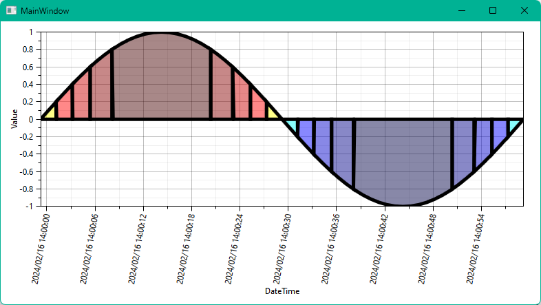

# MultiColorAreaSeriesSample
OxyPlot TwoColorAreaSeries を MultiColor に拡張したサンプル。 
yの値が指定した範囲内であるときに，そのエリアを指定した色に染めます。

## Example
[サンプルコード](MultiColorAreaSeriesSample/MainWindowViewModel.cs)の仕様。

- y = sin(2πft)を描画
- 範囲 
    | range            | color     |
    |------------------|-----------|
    | y < -0.8         | #77000044 |
    | -0.8 <= y < -0.6 | #77000088 |
    | -0.6 <= y < -0.6 | #770000cc |
    | -0.4 <= y < -0.6 | #770000ff |
    | -0.2 <= y < -0.6 | #7700ffff |
    |  0.0 <= y < -0.6 | #77ffff00 |
    |  0.2 <= y < -0.6 | #77ff0000 |
    |  0.4 <= y < -0.6 | #77cc0000 |
    |  0.6 <= y < -0.6 | #77880000 |
    |  0.8 <= y        | #77440000 |
- エリア枠線描画(黒色，線幅5)
- 描画結果
    

## どんな場面で使えるか
例えば， 
「測定したデータがしきい値5未満のエリアは，青色に染めたい。」 
「測定したデータがしきい値5以上のエリアは，黄色に染めたい。」 
「測定したデータがしきい値10以上のエリアは，赤色に染めたい。」 
といったときに，一目でわかるグラフにできる。

> [!WARNING]  
> X軸の時間がずれているのは、[サンプルコード](MultiColorAreaSeriesSample/MainWindowViewModel.cs) の60行目の計算がよろしくないみたい。 
> MajorStep / MinorStep をコメントアウトすると、期待するポイントから表示されるかと思います。
